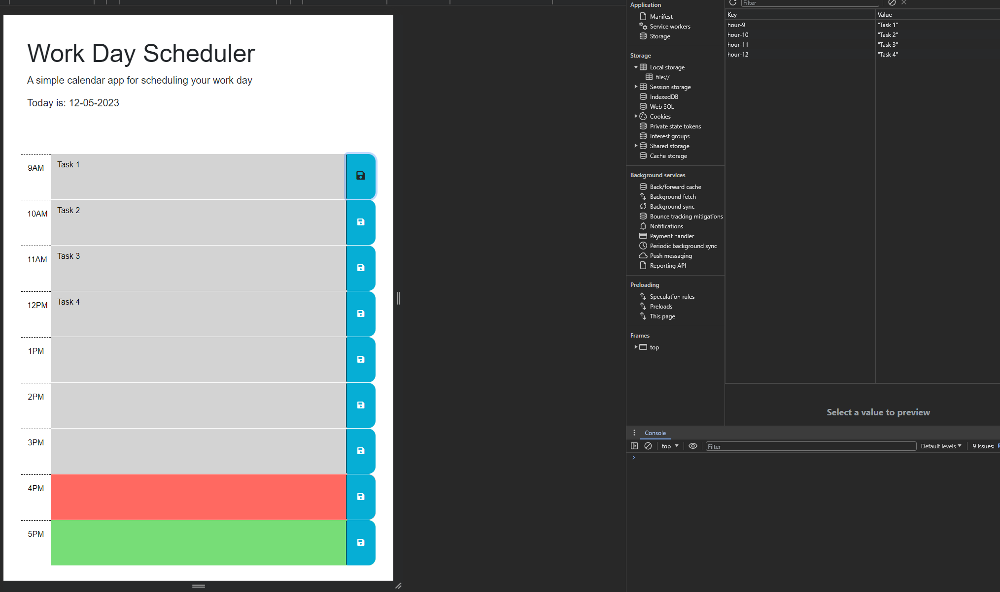

# Work Day Planner

## Description

This webpage allows you to store tasks to complete throughout the day. Local storage allows you to leave the page and come back later with your tasks filled in.

## Usage

- Enter your task for each hour
- Click the save button on the right for each task entered

https://scook9.github.io/module-5-work-scheduler  
https://github.com/scook9/module-5-work-scheduler

## Credits

